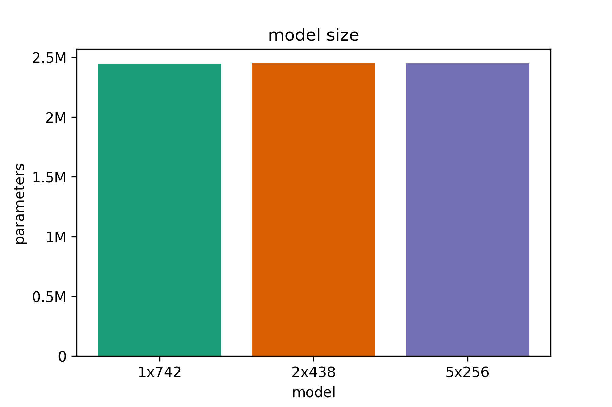
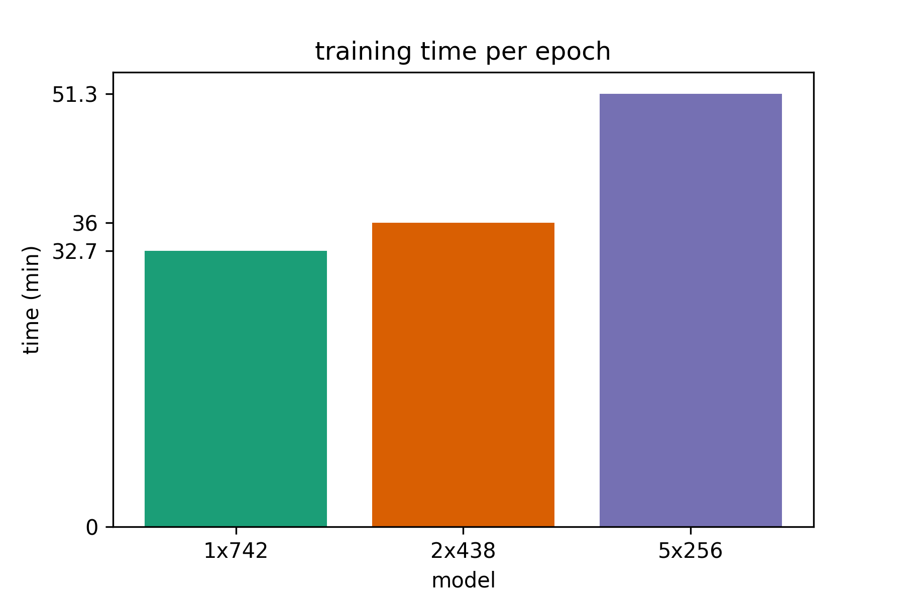
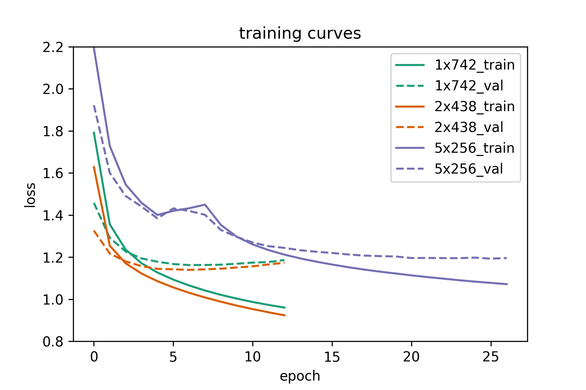
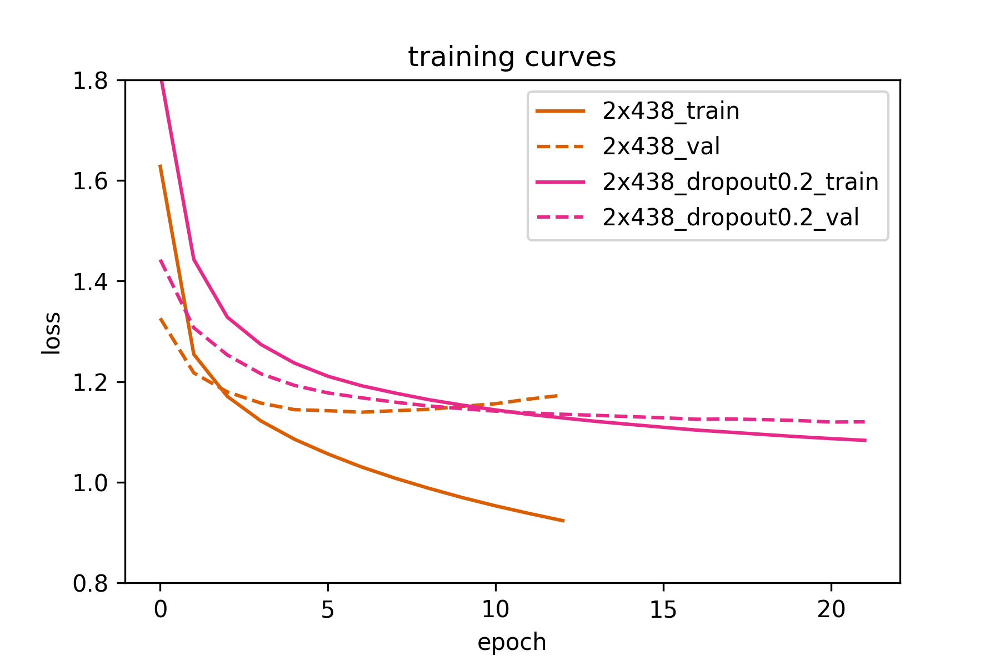
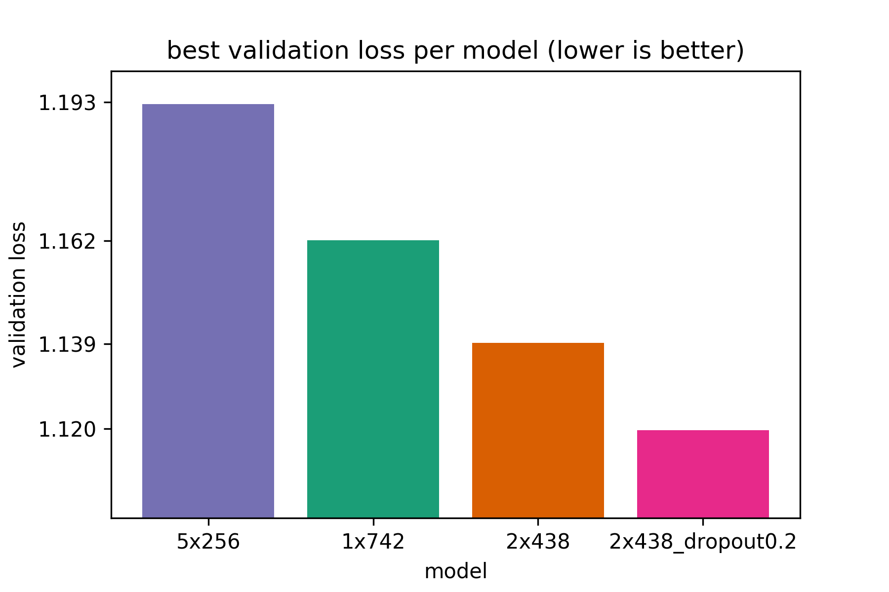

# Deep or Wide RNNs? Let's generate new Sherlock Holmes stories and find out
[Back to index](../index.html)

[Source code for this project](https://github.com/nchlis/sherlocknet)

## Motivation
Let's assume we like books by a certain author. Let's also assume that this

certain author is not publishing books anymore because he/she is in (permanent)

retirement. No need to despair! With the help of A.I. we can train a neural

network to write text in the same style as our favorite author, assuming that

enough training data is available.

## The Actual Motivation
Character to character Recurrent Neural Networks (RNNs) are a nice model

to study the properties of RNNs on a fun problem. They are not the best models

out there for sequence to sequence prediction, but they are easy and fun

to use. So they are perfect for a hobby project. In this specific project

we will use a character to character Long Short Term Memory (LSTM) network

to predict the next character in a sequence of characters. After training,

the very same model can be used to generate arbitrary text in the same

style of the author of the text(s) we used for training.


So we can use a fun problem to study the properties of LSTMs. To be precise,

given a certain **parameter budget** of e.g. 3 Million parameters, what's the

best way to spend them? Should we only use a single layer **wide** LSTM, use

a **deep** stack of narrow LSTMs (few hidden units per layer in the stack) or

is the optimal solution somewhere in between. So to rephrase te problem: given

a parameter budget, is there a **sweet spot** between width and depth of the

network, where we get the best _return of investment_ of our parameter budget?

Let's find out.

## Dataset

We will use the Sherlock Holmes books by Sir Arthur Conan Doyle. One reason

to choose Sherlock Holmes is because the books are interesting, another reason

is that there are many books availabe (8 of them) which means there's enough

training data to get generated text of _reasonable_ quality. It's not going to

be perfect, but it will be fun. One final reason is that all Sherlock Holmes books

are available for free on [Project Gutenberg](https://www.gutenberg.org/)

The following books were used:

1. A study in scarlet
2. The sign of the four
3. The hound of the baskervilles
4. The valley of fear
5. The adventure of sherlock holmes
6. The memoirs of sherlock holmes
7. The return of sherlock holmes
8. His last bow

the header and footer of each book was removed prior to training and

all books were concatenated in a single .txt file of approximately 2.8 MB.

We will predict each character in the training data based it's 30 preceding characters.

So **the model accepts sequences of length 30 as input and predicts a single output each time**.

## Network architectures

We will use keras to define our networks. We will split our training data into

90% training set and 10% validation set. Our training set is approximately 2.5 MB, so

the **parameter budget for the network is approximately 2.5 M** parameters maximum.

We will test out three different network architectures, all of them having approximately

**2.4 M parameters**. Starting from a single-layer LSTM (**model A**), we will move on to

a _thinner_ 2-layer deep LSTM (**model B**) and finally also test an even thinner

and deeper 5-layer LSTM (**model C**). Since we use 2.4 M parameters, less than our parameter budget,

we will **not use dropout**. If overfitting appers to be a proble, we will add dropout later.

The models in detail (as defined in keras) are: 

**model A:** 1-layer deep LSTM, 742 hidden units per layer
```python
dropout=0.0
model = Sequential()
model.add(LSTM(742, input_shape=(maxlen, len(chars)), dropout=dropout))
model.add(Dense(len(chars)))
model.add(Activation('softmax'))
optimizer = 'adam'
model.compile(loss='categorical_crossentropy', optimizer=optimizer)
```
**model B:** 2-layer deep LSTM, 438 hidden units per layer
```python
dropout=0.0
model = Sequential()
model.add(LSTM(438, input_shape=(maxlen, len(chars)), return_sequences=True, dropout=dropout))
model.add(LSTM(438, dropout=dropout))
model.add(Dense(len(chars)))
model.add(Activation('softmax'))
optimizer = 'adam'
model.compile(loss='categorical_crossentropy', optimizer=optimizer)
```
**model C:** 5-layer deep LSTM, 256 hidden units per layer
```python
dropout=0.0
model = Sequential()
model.add(LSTM(256, input_shape=(maxlen, len(chars)), return_sequences=True, dropout=dropout))
model.add(LSTM(256, return_sequences=True, dropout=dropout))
model.add(LSTM(256, return_sequences=True, dropout=dropout))
model.add(LSTM(256, return_sequences=True, dropout=dropout))
model.add(LSTM(256, dropout=dropout))
model.add(Dense(len(chars)))
model.add(Activation('softmax'))
optimizer = 'adam'
model.compile(loss='categorical_crossentropy', optimizer=optimizer)
```

## Results

We will use keras to define our networks. We will split our training data into

We will train all models using a batch size of 512, until the validation loss converges

or starts overfitting. For each of the models (A, B or C) we will save the model version

(model weights) that achieve the best results in terms of validation loss.

### Model size

All models have approximately the same number of **2.44 M** parameters. This is important 

since we only want to investigate the effect of added depth on model performance, if we

simply stack layers of the same size on each other, a model with more layers will have

more parameters and will not be directly comparably to a deeper or shallower model.

 

### Training time per epoch

We can see that deeper models take longer to train, probably since the optimizer is having

a hard time. Recent advances in feed-forward networks such as **batch normalization** and **residual connections**

have not yet been established in _mainsteam_ LSTM architectures, but there are promising results. Links to

some interesting papers in this direction are included in the end of the post (Recurrent batch normalization

and Residual LSTM).

 

### Number of epochs until convergence

So deeper networks need more time per epoch. But how many epochs are needed until convergence?

As we can see from the following plot the 1 and 2-layer LSTMs converge very fast and start overfitting

before 10 epochs. On the other hand, the 5-layer LSTM needs 2 to 3 times as many epochs for the validation

loss to start converging.

 

## The verdict

**So, are deeper recurrent networks worth it? Yes, if they are not too deep**. As we can see above, the 1-layer LSTM is worse than the

2-layer network in terms of performance (although it trains fast). **The 2-layer LSTM is the best network in terms of performance**

(validation loss) and is very close to the 1-layer network in terms of overall training time (time per epoch and number of epochs

until convergence). The 5-layer network is not as useful. It is much harder and slower to train than the 2-layer network and is the worst

of all networks in terms of performance.

## Can we do better?

As we discussed above, **Recurrent Batch Normalization** and **Residual LSTM** (links at the end of the article) seem promising approaches

to training deep recurrent networks, but we're not there yet. However, in this specific problem we saw that even our _best_ 2-layer LSTM

starts overfitting quite early. So let's train it again, this time using a **small value of dropout=0.2** and see if the validation loss improves.

**Using dropout minimally increases training time per epoch, but needs 2 or 3 times the number of epochs to reach a minimum value for the validation loss.**

In this case, the training time per epoch increased by 2.5 min from 36 to 38.5 min per epoch, but converged much later as seen in the training curve. 

The **original 2-layer LSTM achieves 1.139 validation loss (7th epoch)**, while the **2-layer LSTM with dropout=0.2 achieves 1.12 validation loss (20th epoch)**.

So we did manage to improve results a little bit. Another thing we could try is increasing the sequence length used for prediction. We currently predict

the 31st character based on the 30 preceding characters. We could possibly get more interesting results if we predict e.g. the 101st character based

on the 100 preceding characters, but such an approach would be more time & memory intensive. 

 

## Summary: best performance of all models

Here we show the best validation loss achieved by all models (lower is better). We see that the 2-layer LSTM with dropout 0.2 outperforms all

other models, while the 5-layer LSTM performs the worst. So deeper models can be better than shallow, 1-layer LSTMs. However, recurrent models that are too deep

are more difficult to train (at least for the moment).

 

## Example generated text

Here we showcase some text generated by the best model (2-layer LSTM, dropout = 0.2). The random seed used as input to the model before text

generaton begins consists of the following 30 characters: 'On the very day that I had com'.

We will generate 800 characters for different values of diversity. The diversity (or temperature) controls the _degree of randomness_ used

when sampling from the models output. For low values of diversity (e.g. 0.1) we only sample characters that the model is very sure about.

The text makes sense, but tends to be repetitive and boring. For high values of diversity (e.g. 1 or greater) the generated text might not make any

sense. The good thing is that we can **try out different values of diversity with the same trained model** (usual values are in [0,1]). Then,

we can select the value of diversity that qualitatively yields the best results.

```html


===== diversity: 0.1 =====
on the very day that i had come to the station and the colonel and the colonel and the station which had been so far 

as to the station and the colonel and the strange expression of the station and the station which had been seen the 

same as the other was a strong problem which had been a man of the man who had been a very serious conclusion, and i 

was able to see you to the station. i think that i have no doubt that i have not been taken as a strange story of the 

station and the colonel and the station of the station and the station which had been seen the state of the station 

and the colonel and the station which had been so far as to the man of the matter. i was able to see that the man was 

a very small part of the station. i was able to see that the man was a very strange conclusion that i have not been 

taken to the

===== diversity: 0.3 =====
on the very day that i had come to his little time, and i was able to prove that the man was a strong problem which 

would be able

to see him in the morning.”


“what a man was a common conversation which had been taken to his face. “i will not tell you that this should be a 

man of the matter upon the moor?”


“no, i said that the blow was a state of great careless and of my mind and the

whole house was a strange conclusion which was a little man who had been so drawn in the middle of the moor. the lady 

was a pretty strong problem of the facts. i think that i am afraid that i should be very happy to see the station and 

the single character of the house and a look of the house was struck by the station and admiration was still and as 

he could not have been a promise of the matter which i shall be able to see you to the con

===== diversity: 0.5 =====
on the very day that i had come. i should be very glad to have the station of the stream of being

a very strange curious business.  the facts are seriously a man to get up and down. i was at the admirable corner of 

the man who had been done by the police and leave to the strength of the terrible steps and the convict showed me 

that the news are at the man, and that i can see that the

furniture was too much to see him in the law. you said that i could not have to strange and likely that the other 

reason was on the same conclusion. at the same time, i should not give me a singular advantage of the world that they 

had

shown the advantage of his own country. he was an accident and committed to the convict, as it seemed to me that he 

had been made a large

party to see that he was able to see that it was a man of a man of my

===== diversity: 0.7 =====
on the very day that i had come to

any very far to give him in the

same ways of his problem for a strange visitor when the third geemen was still an oath and earnest word. the house 

may have made a carpet. i will

rehurd to the hound to serve these things as to the better?”


“no, no, it is so earnest about the fastent which is too much

able to explain the planking importance to the advertisement which he

had drawn down the door, and the

two continents and murmur showed that the case was so very successful that i should be a man who will certainly do 

it. the carriage would end in the station, and i was standing in his chair and confessed that the great person who

did not find the light upon the middle. it is never bad.”


“none of them are all dreadful.  a month, and that if they were reported to your judgment. the clue w

===== diversity: 1 =====
on the very day that i had come drooping pouch of six air,

it is slightened by an end."


"if dr. mortimer has seen, and

pale cab, since you shauld see a glimpse of that day?"


"no; but there was him and was still weary. it

carefully come from the point.”


“so for it! i think, dr. mortimers i shall need and

make the glimpses."


"what is consequent name? well, you are well sitting in

the meantime. i can easily do so,

for she does not give us on, mr. jonas oney,

and came to a coronet and a square

of hound, for the invalid lib,

leaved ourselves, and the once since everything according to the next bottle and edge took ryaffership about the 

brussion

of his village.  i have night at once did he interrupt you, sir. but, i fancy that what my wretched death shall

not propose, watson?"


"i tell you that you may have made your hei

===== diversity: 2 =====
on the very day that i had comjupinited.  we picked, shaved-peosezt or kenne,

came backpoof, uppersiglizan effrois, just

fapa awgy. yunding

from the lent ermak to-maw?’ tais violet

object about whomeeting it should underivel?"


"is bliosi-raising syfic froe who rrouddn;

est, lorsh-glag from

moilayiam, unty daughter; she kept yax 127 pions upon druw?”


my frodk?"


svitetmus dcmuchest into eye if “you

know anyefus o'clock?” holmes sor,, laughing

wibdled, layfift.' eothur

piere xon toulla.’


“‘ohlahily?"


"i enterectay'--that," he apploved, né know,

perhaps do; why's four’peds, didnegiant!

firun, tobding


442 evidence’s

idmanu, mr., usband."-

in fvalkyil-st; n’k befile the villeter    'us my horsor for a

policymatch_’, glmantit [29 h’:h’t.”


“and i?'w

"it’s bought to jee-undup luffed, ‘you

bring holpeu gum.


    let. he'’

```

## The 10,000 character generated example

Here we will do our best to write a new Sherlock Holmes story. Sadly, our LSTM does not perform as well as Sir Arthur Conan Doyle.

But this doesn't mean we can't have some fun reading the text. It also helps us understand better what our model actually learns to generate.

[Here's the link to the 10,000 character example](https://github.com/nchlis/sherlocknet/blob/master/generated_text_10Kchars.txt)

## Code availability

The source code of this project is [freely available on github](https://github.com/nchlis/sherlocknet).

## Additional information & Useful links

* [cs231n RNN/LSTM lecture on youtube](https://www.youtube.com/watch?v=iX5V1WpxxkY)

* [Andrej Karpathy's blog post on char-to-char RNNs](http://karpathy.github.io/2015/05/21/rnn-effectiveness/)

* [Keras example on character to character text generation](https://github.com/fchollet/keras/blob/master/examples/lstm_text_generation.py)

* [paper - Generating Sequences With Recurrent Neural Networks](https://arxiv.org/abs/1308.0850)

* [paper - Long Short-Term Memory (LSTM original paper)](http://dl.acm.org/citation.cfm?id=1246450) 

* [paper - Recurrent Batch Normalization](https://arxiv.org/abs/1603.09025)

* [paper - Residual LSTM: Design of a Deep Recurrent Architecture for Distant Speech Recognition](https://arxiv.org/abs/1701.03360)


