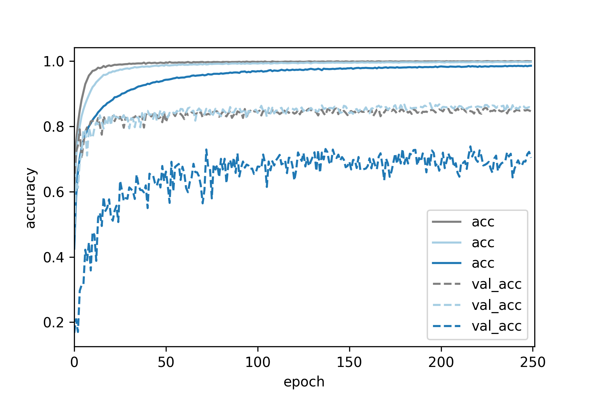

# Applying Dropout in Convolutional Neural Nets: Where and to what extent?
[Back to index](../index.html)

[Source code for this project](https://github.com/nchlis/CNN_dropout)

## Motivation: Do we still need Dropout?
### Short answer: Yes.
Convolutional Neural Networks (CNNs) are currently the state of the art method

when it comes to computer vision tasks. However, usually the datasets available

are not large _enough_ so CNNs tend to overfit and not generalize as well to

new data. [Dropout](http://jmlr.org/papers/v15/srivastava14a.html) is the standard method of regularizing neural networks

(including CNNs) and has been used extensively over the years. For example in

[VGG](https://arxiv.org/pdf/1409.1556.pdf) or [VGG-like networks](https://arxiv.org/pdf/1502.01852.pdf) . Nevertheless, **Dropout tends to increase the number**

**of epochs required until convergence**. 


As a result, lately there's an emerging trend (e.g. [Inception v3](https://arxiv.org/abs/1512.00567) and [Residual Networks](https://arxiv.org/abs/1512.03385))

to only apply [Batch Normalization](https://arxiv.org/abs/1502.03167) which also has a regularizing effect.


In the original Dropout paper it is demonstrated that it is beneficial to apply

Dropout fully connected, as well as convolutional layers in a VGG-like network.

Nevertheless, in most cases where Dropout is used, it is usually applied 

**only in the last fully connected layer(s)** in [VGG](https://arxiv.org/pdf/1409.1556.pdf), [VGG-like networks](https://arxiv.org/pdf/1502.01852.pdf)

or other architectures like [Xception](https://arxiv.org/abs/1610.02357). In [Inception v4](https://arxiv.org/abs/1602.07261)

Dropout is applied only to the last average pooling layer, since there are no

fully connected layers. One exception to the above trend is [Wide ResNets](https://arxiv.org/abs/1605.07146), where

it is demonstrated that applying dropout between convolutional layers in ResNets

is generally a good idea.


In this post we will demonstrate that **using Dropout in conjunction with** 

**Batch Normalization is beneficial** even for simple VGG-like architectures.

We argue that even in cases where Batch Normalization can complement or possibly

be a subtitute for the the regularizing effect of Dropout, the additional

**ensembling effect of Dropout** still leads to gains in generalization performance.

However, this comes at the **cost of additional epochs** being required during training.

## Where to apply Dropout?
### Both in Conv and Fully Connected layers, but to different extent.

We will show that applying Dropout in convolutional layers can be tricky. To be

precise, if the dropout probability is too high, the overal performance of the 

network deteriorates. But If the dropout probability in the convolutional layers

is small enough, there is an increase in performance. Moreover, we will study in

more detail the **effect of dropout in convolutional layers of different depth** in

in the network. Something that is hinted at, but not fully demonstrated in the 

original Dropout paper.

## The CIFAR-10 dataset

The [CIFAR 10 dataset](https://www.cs.toronto.edu/~kriz/cifar.html) consists of 60,000 images (50,000 training, 10,000 test set)

that belong to 10 distinct categories. Each image is 32x32x3. It's quite small

for today's standards but it is a nice dataset to play around with, since re-training

a different network on it is relatively fast (few hours). So it's perfect for experiments

if you are doing deep learning on a _less-than-infinite_ budget. Next, we show

one image for each of the classes present in the dataset

 

Just a reminder: the purpose of this post is to explore the properties of Dropout

in CNNs, not to reach state of the art results in CIFAR10. In this post we will use

the CIFAR10 _test set_ as a _validation set_ (to save the model that performs best

on the validation set during training). So to be technically correct, accuracy on

the CIFAR 10 test set, is validation accuracy (and not test accuracy) in this case.

## Network architecture

We will use keras to define our networks. We will use a VGG-like convolutional

network that consists of 6 convolutional and 2 fully connected layers. The convolutional

layers are separated into 3 blocks of 2 layers each. Convolutional layers in the

same block have the same number of features. We apply Dropout and max-poooling after every

convolutional block. We apply Batch Normalization before every ReLU activation.

Finally, we apply Dropout after every Fully Connected (Dense) layer. We will use

[adam](https://arxiv.org/abs/1412.6980) to train the network, with default parameters as set defined by Keras

(lr=0.002, beta_1=0.9, beta_2=0.999, epsilon=1e-08, decay=0.0). We will train

each network for 250 epochs and save the model with the best performance on the

validation set.

### The newtork in detail

Please note that a dropout layer with dropout probability = 0, is just an

identity layer. This allows us to re-use the same code to define networks that

do or do not have dropout at different points, just by changing the argument

of the dropout layer. Overall, the network has **approximately 2M parameters**

```python
nfilters = [64,128,256]
ndense = 512
add_BatchNorm = True
dropout_rate_conv = [0.0, 0.0, 0.0]#1 value for each conv block
dropout_rate_dense = 0.0

model_id='CNN_bn_'+str(add_BatchNorm)+'_dropConv_'+str(dropout_rate_conv[0])+'_'+\
str(dropout_rate_conv[1])+'_'+str(dropout_rate_conv[2])+'_'+'dropDense_'+str(dropout_rate_dense)
print('Build model...',model_id)

model = Sequential()

#Conv block #1
model.add(Conv2D(nfilters[0], (3, 3), padding='same',
                 input_shape=X_tr.shape[1:]))
if(add_BatchNorm==True):
    model.add(BatchNormalization(axis=-1))
model.add(Activation('relu'))
model.add(Dropout(dropout_rate_conv[0]))

model.add(Conv2D(nfilters[0], (3, 3)))
if(add_BatchNorm==True):
    model.add(BatchNormalization(axis=-1))
model.add(Activation('relu'))
model.add(Dropout(dropout_rate_conv[0]))

model.add(MaxPooling2D(pool_size=(2, 2)))

#Conv block #2
model.add(Conv2D(nfilters[1], (3, 3), padding='same'))
if(add_BatchNorm==True):
    model.add(BatchNormalization(axis=-1))
model.add(Activation('relu'))
model.add(Dropout(dropout_rate_conv[1]))

model.add(Conv2D(nfilters[1], (3, 3)))
if(add_BatchNorm==True):
    model.add(BatchNormalization(axis=-1))
model.add(Activation('relu'))
model.add(Dropout(dropout_rate_conv[1]))

model.add(MaxPooling2D(pool_size=(2, 2)))

#Conv block #3
model.add(Conv2D(nfilters[2], (3, 3), padding='same'))
if(add_BatchNorm==True):
    model.add(BatchNormalization(axis=-1))
model.add(Activation('relu'))
model.add(Dropout(dropout_rate_conv[2]))

model.add(Conv2D(nfilters[2], (3, 3)))
if(add_BatchNorm==True):
    model.add(BatchNormalization(axis=-1))
model.add(Activation('relu'))
model.add(Dropout(dropout_rate_conv[2]))

model.add(MaxPooling2D(pool_size=(2, 2)))

#at this point each image has shape (None, 2, 2, nfilters[2])
model.add(Flatten())
#at this point each image has shape (None, 2*2*nfilters[2])

model.add(Dense(ndense))
if(add_BatchNorm==True):
    model.add(BatchNormalization(axis=-1))
model.add(Activation('relu'))
model.add(Dropout(dropout_rate_dense))

model.add(Dense(ndense))
if(add_BatchNorm==True):
    model.add(BatchNormalization(axis=-1))
model.add(Activation('relu'))
model.add(Dropout(dropout_rate_dense))

model.add(Dense(num_classes))
model.add(Activation('softmax'))

model.compile(loss='categorical_crossentropy',
              optimizer='adam',
              metrics=['accuracy'])
```

## Results

For the remainder of this post we will consider 2 levels of Dropout, for simplicity:

* _Low Dropout_: 0.2 probability to drop a unit.

* _High Dropout_: 0.5 probability to drop a unit.

## Establishing a baseline with Batch Normalization

We will consider a batch normalized version of the network as the baseline for

all subsequent comparisons. Batch normalization leads to a considerable increase

in classification accuracy of the validation set, compared to ta _vanilla_ version

of the network where no regularization is used.

 

 

#### Note: Batch Normalization increased execution time per epoch by ~41%

We can see that training the _vanilla_ network deteriorates after ~150 epochs,

perhaps since no decay was used with adam. On the other hand, there are no problems

when training the batch normalized version of the network.

## Dropout in Conv layers: Low is beneficial, High is bad.

#### Low Dropout: increase in test accuracy

We do not apply dropout after the fully connected (Dense) layers. In the

**low dropout setting** we setup the above network according to:

```python
nfilters = [64,128,256]
ndense = 512
add_BatchNorm = True
dropout_rate_conv = [0.2, 0.2, 0.2]#low dropout of 0.2
dropout_rate_dense = 0.0
```
As we can see below, applying batch normalization + low dropout increases classification

accuracy on the validation set, compared to the baseline (batch normalization, no dropout).

#### High Dropout: training the network is (probably) harder

In the **high dropout setting** we setup the network according to

```python
nfilters = [64,128,256]
ndense = 512
add_BatchNorm = True
dropout_rate_conv = [0.5, 0.5, 0.5]#high dropout of 0.5
dropout_rate_dense = 0.0
```
If we increase the dropout probability to 0.5, the performance of the network

deteriorates. 

 

 

Deterioration of network performance with high dropout in the convolutional layers

may be attributed to one of two possible causes (or both).

**(1)** High dropout of 0.5 leaves out half the network, so the CNN does not have enough

capacity to model the task at hand.

**(2)** High dropout hinders training of the CNN.

We demonstrate that **(1)** is not the case, by training a network where we

use batch normalization, no dropout but **halve the number of filters** at each convolutional

layer. 

```python
nfilters = [32,64,128] #half number of filters
ndense = 512
add_BatchNorm = True
dropout_rate_conv = [0.0, 0.0, 0.0]
dropout_rate_dense = 0.0
```
The smaller network performs much better than the large network with 0.5

dropout, so model capacity is not a problem. Therefore, we conclude that

**Using high dropout values in convolutional layers probably hinders training**.

 


## Dropout in Fully Connected layers: The more the merrier.

In general, increases Dropout in Fully Connected (Dense) layers is a good idea,

since units of fully connected layers are much more reduntant than units of 

convolutional layers. However, larger values of Dropout tend to require a larger

number of epochs until convergence (but the execution time per epoch is pretty much

the same). Last, one should be aware of the extreme case where Dropout is too

high and the network is underfitting. 

In the **low dropout setting** we setup the above network according to:

```python
nfilters = [64,128,256]
ndense = 512
add_BatchNorm = True
dropout_rate_conv = [0.0, 0.0, 0.0]
dropout_rate_dense = 0.2#low dropout of 0.2
```
In the **high dropout setting** we setup the network according to

```python
nfilters = [64,128,256]
ndense = 512
add_BatchNorm = True
dropout_rate_conv = [0.0, 0.0, 0.0]
dropout_rate_dense = 0.5#high dropout of 0.5
```
We can see than increases dropout in fully connected layers increases classification

accuracy on the test set, but **the improvement is marginal** compared to adding

dropout after the convolutional layers. One possible expanation for this

could be that in the above network, the **dense layers correspond to ~0.8M** parameters

out **of the ~2M** parameters of the network. So is the improvement marginal

because dense layers are responsible for a minority of the overall parameters

of the network? We will come to this later. 

 


## Dropout in the Convolutional and Fully Connected layers: best overall performace

Now we combine what we learned above and apply dropout in both the convolutional

and fully connected parts of the network. We only use Dropout with probability 0.2

for the convolutional layers and we try out Dropout with probability 0.2 or 0.5

for both fully connected layers.

So the first network is:

```python
nfilters = [64,128,256]
ndense = 512
add_BatchNorm = True
dropout_rate_conv = [0.2, 0.2, 0.2]
dropout_rate_dense = 0.2#low dropout of 0.2
```
while the second network is:

```python
nfilters = [64,128,256]
ndense = 512
add_BatchNorm = True
dropout_rate_conv = [0.2, 0.2, 0.2]
dropout_rate_dense = 0.5#high dropout of 0.5
```
We can see that simply combining what performed best in our previous tests:

Dropout 0.2 in the convolutional and Dropout 0.5 in the fully connected parts,

led to the best result overall.

 


#### Upscaling the Fully Connected layers

Previously we speculated whether the minimal increase in performance when applying

Dropout in the fully connected layers only can be attributed to the fact that 

fully connected layers make up for ~**0.8M** of the ~**2M** parameters of the network.

Now we demonstrate that **adding Dropout in convolutional layers is beneficial,**

**even if fully connected layers make up for the majority of model parameters. **

To be precise, we upscale both fully connected layers from 512 to 1024 units each,

while leaving the convolutional part of the network the same. Now the fully connected

layers make up for ~**2M** of the ~**3.2M** parameters of the network. Next, we

evaluate 3 different versions of the network

No Dropout, only Batch Normalization:

```python
nfilters = [64,128,256]
ndense = 1024
add_BatchNorm = True
dropout_rate_conv = [0.0, 0.0, 0.0]
dropout_rate_dense = 0.0
```
Dropout in the fully connected layers only:

```python
nfilters = [64,128,256]
ndense = 1024
add_BatchNorm = True
dropout_rate_conv = [0.0, 0.0, 0.0]
dropout_rate_dense = 0.5# later 0.75
```
Dropout in the convolutional & fully connected layers:

```python
nfilters = [64,128,256]
ndense = 1024
add_BatchNorm = True
dropout_rate_conv = [0.2, 0.2, 0.2]
dropout_rate_dense = 0.5# later 0.75
```
Adding dropout to the fully connected layers marginally increased validation

accuracy, while also adding dropout in the convolutional layers had a more 

pronounced positive effect. It is interesting however, that none of the new

configurations beat the previous best of 0.8831 validation accuracy.

 


## Applying Dropout to Convolutional Blocks of different depth

Let's see what happens if we add _low_ dropout of 0.2 and _high_ dropout of 0.5

to **only 1 of the 3 convolutional blocks**. 

_Reminder:_ The network consists of 3 convolutional blocks, with each block

consisting of 2 convolutional layers, while each convolution is followed by

Batch Normalization and a ReLU activation function. After each convolutional

block, max pooling is performed.

**Does the effect of Dropout depend on the depth of the convolutional block?**

**Yes!** As we can see below, shallower convolutional blocks are more sensitive to

Dropout, so lower values are recommended. As we go deeper into the network,

higher values of Dropout can be used. For example, in the third convolutional block

there is an increase in performance even if we use _high_ dropout (but _low_ dropout

increases performance even more).

 

## Code availability

The source code of this project is [freely available on github](https://github.com/nchlis/CNN_dropout).

## Additional information & Useful links

* [cs231n CNN lecture on youtube.](https://www.youtube.com/watch?v=LxfUGhug-iQ)

* [cs231n lecture on youtube, covering Dropout, Batch Normaliztion and Adam.](https://www.youtube.com/watch?v=hd_KFJ5ktUc)

* [92.45% on CIFAR-10 in Torch](http://torch.ch/blog/2015/07/30/cifar.html)

* [Keras example on CIFAR classification](https://github.com/fchollet/keras/blob/master/examples/cifar10_cnn.py)

* [paper - Dropout: A Simple Way to Prevent Neural Networks from Overfitting](http://jmlr.org/papers/v15/srivastava14a.html)

* [paper - Batch Normalization: Accelerating Deep Network Training by Reducing Internal Covariate Shift](https://arxiv.org/abs/1502.03167)

* [paper - Very Deep Convolutional Networks for Large-Scale Image Recognition](https://arxiv.org/abs/1409.1556)

* [paper - Delving Deep into Rectifiers: Surpassing Human-Level Performance on ImageNet Classification](https://arxiv.org/pdf/1502.01852.pdf)

* [paper - Rethinking the Inception Architecture for Computer Vision](https://arxiv.org/abs/1512.00567)

* [paper - Deep Residual Learning for Image Recognition](https://arxiv.org/abs/1512.03385)

* [paper - Inception-v4, Inception-ResNet and the Impact of Residual Connections on Learning](https://arxiv.org/abs/1602.07261)

* [paper - Xception: Deep Learning with Depthwise Separable Convolutions](https://arxiv.org/abs/1610.02357)

* [paper - Wide Residual Networks](https://arxiv.org/abs/1605.07146)


